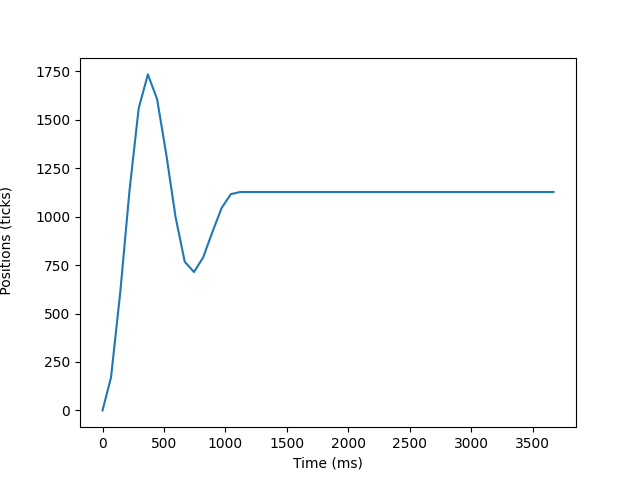
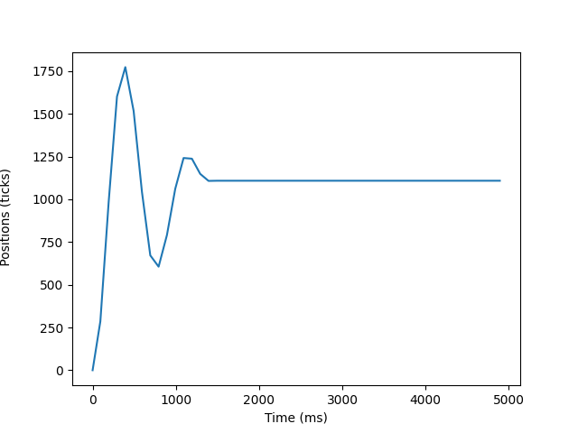
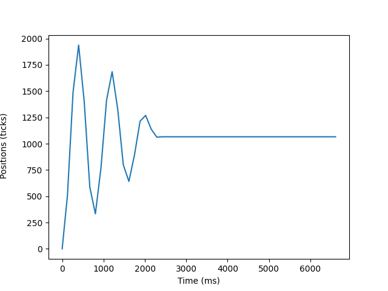

# ME405 Lab3: On Schedule
### **Tristan Cavarno, Miloh Padgett, Jon Abraham**

## Overview 
This lab involves applying the previously used **ClossedLoopController**, **MotorDriver**, and **EncoderReader** 
modules to the concept of tasks. The preformance of the **ClosedLoopController** was tested under differing sample and response periods to show the degrading preformance as a function of sample period. The utility of tasking was then explored through the introduction of a second flywheel motor. Pseudo-parallelism was used to drive two motors at the same time to differing steady state positions.

## Single Task P-Control
Using the source code from *Lab 2* A task was broken up into two major section the **init_flywheel_one()** and **control_loop_one()**. Initialiation of used modudes occures during the first call to (or first few calls if this time takes longer than the period) **task1_fun()**. Then the **task1_fun** will loop forever yeilding  to the scheduler after each iteration of the loop. This is where **control_loop_one()** samples the the encoder, generates the according motor output, and changes the motor speed.

For ease of data collection a variable *n* was created during initalization to count the number of yields and thus a rough approximation of time. Each iteration, n was incremented until a target value was reached. The motors where then turned off and **get_response()** was called printing all time-output pairs to the thonny console. This was copy pasted into a csv file and the plots below were generated using hw1's python script.

**Figure 1.** Using a task period of 75 ms we see reasonable steady state error and few oscillations. This isn't quite as good as the 10 ms sampling period but still reaches steadstate with minimal error.

**Figure 2.** Using a task period of 100 ms we see reasonable steady state error and but the settling time is increased with more oscillation. This isn't quite as good as the 75 ms sampling period but still reaches steadstate with minimal error and similar settiling time desipite the increased oscillation.

**Figure 3.** Using a task period of 135 ms we see a doubling in the settling time and several oscillations. This figure shows the degredation of the controller as the sample time increases.

## Dual Task P-Control
After the above data was collected a new task was created. Because these two tasks will run independently no shares were used **task2_fun()** is almost identical to **task1_fun()** except for it calling **init_flywheel_two()**. This function is configured to run on the other h-bride control pins and has its own **ClosedLoopController**, **MotorDriver**, and **EncoderReader**. In addition a different target position was set to show the uniqueness of the task. Due to the generic implmentation of **control_loop_one()** we used this function in both tasks to set the output however the objects passed to this function differed between the tasks.

The resultant functionality was demonstrated to the lab professor at the end of lab.